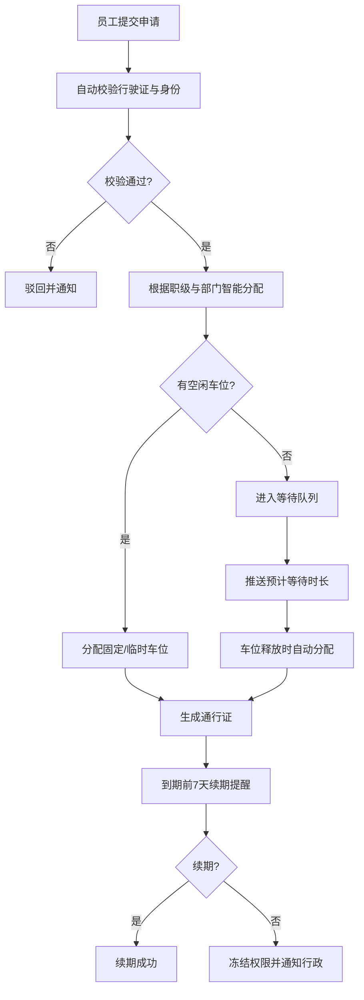

## 1. 产品概述

车辆通行证管理系统，实现企业内部车辆通行、车位分配、计费管理的全流程自动化，解决人工审批效率低、车位分配不合理、费用核算复杂等问题，提升停车场管理效率与员工体验。

- 面向企业员工、行政管理人员、财务人员三类角色
- 核心价值：自动化审批、智能化分配、精准化计费、可视化报表

## 2. 核心 Features

### 2.1 用户角色

| 角色 | 登录方式 | 核心权限 |
|------|----------|----------|
| 员工 | 工号登录 | 提交通行证申请、查看本人车辆记录、查看车位状态、续期申请 |
| 行政 | 工号登录（管理员权限） | 全量车位管理、申请审批、权限冻结、查看所有记录、系统配置 |
| 财务 | 工号登录（财务权限） | 查看费用明细、导出账单、核对扣费记录 |

### 2.2 Feature Module

1. **登录认证页**：工号密码登录、角色识别、权限控制
2. **仪表盘**：车位使用率概览、今日出入统计、待处理事项、趋势图表
3. **通行证申请**：提交行驶证信息、自动校验身份一致性、申请状态追踪
4. **车位管理**：车位分配、等待队列、区域配置、职级/部门规则设置
5. **出入记录**：车牌识别记录、停留时长计算、超时计费明细
6. **费用管理**：计费规则设置、工资自动扣除、财务对账导出
7. **统计报表**：使用率分析、超时比例、平均等待时长、PDF/Excel导出
8. **系统日志**：操作记录查询、按条件筛选、批量导出
9. **续期管理**：到期提醒、续期申请、超期冻结

### 2.3 Page Details

| 页面名称 | 模块名称 | Feature description |
|----------|----------|---------------------|
| 登录页 | 登录表单 | 工号输入、密码校验、角色自动识别、错误提示 |
| 仪表盘 | 数据概览 | 车位使用率环形图、今日出入趋势柱状图、待处理事项列表、关键指标卡片 |
| 通行证申请 | 申请表单 | 车辆信息录入、行驶证照片上传、自动校验、提交与状态显示 |
| 我的申请 | 申请列表 | 历史申请记录、审批状态、有效期、续期按钮 |
| 车位分配 | 分配管理 | 区域车位列表、智能分配、手动调整、等待队列显示 |
| 车位配置 | 规则设置 | 区域配置、职级/部门分配规则、计费规则设置 |
| 出入记录 | 记录列表 | 车牌号码、入场/出场时间、停留时长、费用明细、筛选查询 |
| 费用管理 | 费用明细 | 员工费用列表、月度汇总、工资扣除记录、导出Excel |
| 统计报表 | 报表中心 | 使用率趋势图、超时比例分析、平均等待时长、PDF/Excel下载 |
| 系统日志 | 操作日志 | 操作类型、操作人、时间、详情、多条件筛选、批量导出 |
| 通知中心 | 消息列表 | 续期提醒、审批通知、车位分配通知、超时警告 |

## 3. 核心流程

### 3.1 通行证申请流程

员工提交申请 → 系统自动校验行驶证与员工身份 → 校验通过 → 根据职级与部门智能分配车位 → 区域已满则进入等待队列 → 推送分配结果/预计等待时长 → 生成通行证

### 3.2 车辆出入流程

车牌识别入场 → 记录入场时间 → 车牌识别出场 → 计算停留时长 → 超时部分按分钟计费 → 从当月工资自动扣除 → 推送扣费通知

### 3.3 续期管理流程

通行证到期前7天 → 自动推送续期提醒 → 员工提交续期申请 → 行政审批/自动续期 → 超期未续 → 冻结权限 → 通知行政人员

### 3.4 数据统计流程

每日凌晨0点 → 统计各区域停车位使用率 → 计算超时比例 → 分析平均等待时长 → 生成趋势图表 → 导出PDF和Excel报告 → 推送给管理员

### 3.5 核心流程图

## 4. 用户界面设计

### 4.1 设计风格

- **主色调**：深蓝色 (#1E3A8A) 作为主色，代表专业、可信赖
- **辅助色**：天蓝色 (#3B82F6) 用于交互元素，翠绿色 (#10B981) 表示成功状态，琥珀色 (#F59E0B) 表示警告，红色 (#EF4444) 表示错误
- **中性色**：深灰 (#1F2937) 用于文字，浅灰 (#F3F4F6) 用于背景
- **按钮样式**：圆角矩形 (8px)，悬停时有微妙阴影和颜色加深效果，主按钮使用深蓝色填充，次要按钮使用边框样式
- **字体**：标题使用 "Noto Sans SC" 700，正文使用 "Noto Sans SC" 400，数字使用等宽字体 "JetBrains Mono"
- **布局风格**：左侧导航栏 + 顶部面包屑 + 主体内容区，卡片式布局，清晰的模块分隔
- **图标风格**：使用 Phosphor Icons 线性图标，保持简洁统一

### 4.2 页面设计概览

| 页面名称 | 模块名称 | UI Elements |
|----------|----------|-------------|
| 登录页 | 登录卡片 | 居中布局，毛玻璃背景效果，左侧品牌展示区，右侧登录表单，动效过渡 |
| 仪表盘 | 概览卡片 | 四个核心指标卡片带渐变背景，车位使用率环形图，出入趋势面积图，待办列表 |
| 通行证申请 | 表单页 | 分步表单设计，进度指示器，表单验证实时反馈，行驶证上传预览 |
| 车位管理 | 数据表格 | 车位状态可视化（绿色可用/红色占用/黄色等待），拖拽分配，批量操作 |
| 出入记录 | 列表页 | 高级筛选面板，数据表格支持列排序，分页器，行详情展开 |
| 统计报表 | 图表页 | Tab切换不同维度图表，交互式ECharts图表，数据钻取，导出按钮组 |
| 系统日志 | 查询页 | 多条件筛选表单，时间范围选择器，操作日志表格，批量导出复选框 |

### 4.3 Responsiveness

- Desktop-first 设计，主内容区最小宽度 1280px
- 响应式断点：1920px / 1440px / 1280px / 1024px（平板）
- 平板端：左侧导航栏可折叠，表格支持横向滚动
- 移动端：简化为底部Tab导航，关键信息卡片优先展示，复杂表格转为列表视图
- 所有交互元素确保触摸区域 ≥ 44x44px

### 4.4 交互与动效

- 页面加载：整体淡入 + 内容区块依次出现（staggered animation）
- 按钮交互：点击缩放效果 (scale 0.97)，悬停阴影加深
- 表单验证：错误提示抖动动画，成功时绿色对勾渐显
- 数据刷新：骨架屏加载，数字滚动动画
- 模态框：背景模糊 + 缩放进入动画
- 侧边栏：折叠/展开平滑过渡 (300ms ease)
- 图表数据：初次加载时的渐进式绘制动画
