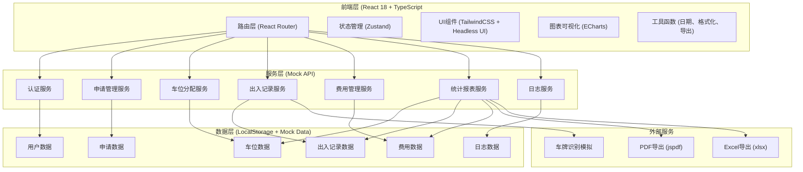
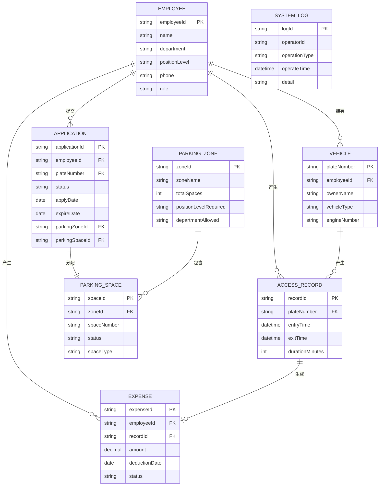

## 1. 架构设计



## 2. 技术栈选择

- **前端框架**：React 18.2.0 + TypeScript 5.3
- **构建工具**：Vite 5.0
- **样式方案**：TailwindCSS 3.4
- **路由管理**：React Router DOM 6.21
- **状态管理**：Zustand 4.4
- **图表库**：ECharts 5.4 + echarts-for-react 3.0
- **UI 组件**：Headless UI 1.7
- **图标库**：@phosphor-icons/react 2.1
- **日期处理**：dayjs 1.11
- **Excel 导出**：xlsx 0.18
- **PDF 导出**：jspdf 2.5 + jspdf-autotable 3.5
- **HTTP 客户端**：axios 1.6
- **模拟数据**：msw 2.0（开发环境）
- **代码规范**：ESLint + Prettier

## 3. 目录结构

```
src/
├── assets/              # 静态资源
│   └── images/        # 图片资源
├── components/         # 公共组件
│   ├── Layout/       # 布局组件
│   ├── Table/        # 表格组件
│   ├── Form/         # 表单组件
│   ├── Charts/       # 图表组件
│   └── ui/           # 基础UI组件
├── pages/             # 页面组件
│   ├── Login/        # 登录页
│   ├── Dashboard/    # 仪表盘
│   ├── Application/  # 通行证申请
│   ├── Parking/      # 车位管理
│   ├── Records/      # 出入记录
│   ├── Finance/      # 费用管理
│   ├── Reports/      # 统计报表
│   ├── Logs/         # 系统日志
│   └── Notifications/ # 通知中心
├── store/             # 状态管理
│   ├── useAuthStore.ts
│   ├── useParkingStore.ts
│   └── useApplicationStore.ts
├── services/          # API服务
│   ├── auth.ts
│   ├── application.ts
│   ├── parking.ts
│   ├── records.ts
│   ├── finance.ts
│   ├── reports.ts
│   └── logs.ts
├── mock/              # Mock数据
│   ├── data/         # 模拟数据源
│   └── handlers.ts  # 请求处理
├── types/             # TypeScript类型定义
│   ├── index.ts
│   ├── application.ts
│   ├── parking.ts
│   └── finance.ts
├── utils/             # 工具函数
│   ├── date.ts
│   ├── format.ts
│   ├── export.ts
│   └── validation.ts
├── hooks/             # 自定义Hooks
│   ├── usePagination.ts
│   ├── useTableSort.ts
│   └── usePermission.ts
├── router/            # 路由配置
│   └── index.tsx
├── App.tsx
└── main.tsx
```

## 4. 路由定义

| 路由路径 | 页面名称 | 权限角色 | 说明 |
|----------|----------|----------|------|
| /login | 登录页 | - | 登录认证，角色识别 |
| /dashboard | 仪表盘 | 员工/行政/财务 | 数据概览、待办事项 |
| /application/new | 新建申请 | 员工 | 提交通行证申请 |
| /application/my | 我的申请 | 员工 | 查看历史申请、续期操作 |
| /application/list | 申请列表 | 行政 | 所有申请管理、审批 |
| /parking/space | 车位分配 | 行政 | 车位状态、分配管理 |
| /parking/config | 车位配置 | 行政 | 区域配置、规则设置 |
| /records/list | 出入记录 | 员工/行政 | 出入记录查询 |
| /finance/expense | 费用明细 | 员工/财务 | 费用查看、导出 |
| /finance/deduction | 扣费记录 | 财务 | 工资扣除管理 |
| /reports/overview | 统计报表 | 行政/财务 | 数据分析、图表展示 |
| /logs/system | 系统日志 | 行政 | 操作记录、审计 |
| /notifications | 通知中心 | 所有 | 消息列表、已读未读 |

## 5. 核心数据模型

### 5.1 ER图



### 5.2 类型定义

```typescript
// 用户类型
interface Employee {
  employeeId: string;
  name: string;
  department: string;
  positionLevel: number;
  phone: string;
  role: 'employee' | 'admin' | 'finance';
}

// 车辆类型
interface Vehicle {
  plateNumber: string;
  employeeId: string;
  ownerName: string;
  vehicleType: string;
  engineNumber: string;
  registerDate: string;
}

// 申请类型
interface Application {
  applicationId: string;
  employeeId: string;
  plateNumber: string;
  status: 'pending' | 'approved' | 'rejected' | 'expired' | 'waiting';
  applyDate: string;
  approvedDate?: string;
  expireDate: string;
  parkingZoneId?: string;
  parkingSpaceId?: string;
  remark?: string;
}

// 车位区域
interface ParkingZone {
  zoneId: string;
  zoneName: string;
  totalSpaces: number;
  usedSpaces: number;
  positionLevelRequired: number;
  departmentAllowed: string[];
  isFixed: boolean;
}

// 停车位
interface ParkingSpace {
  spaceId: string;
  zoneId: string;
  spaceNumber: string;
  status: 'available' | 'occupied' | 'reserved' | 'maintenance';
  spaceType: 'fixed' | 'temporary';
  plateNumber?: string;
}

// 出入记录
interface AccessRecord {
  recordId: string;
  plateNumber: string;
  entryTime: string;
  exitTime?: string;
  durationMinutes?: number;
  overtimeMinutes?: number;
  expense?: number;
}

// 费用记录
interface Expense {
  expenseId: string;
  employeeId: string;
  recordId: string;
  plateNumber: string;
  amount: number;
  overtimeMinutes: number;
  deductionDate: string;
  status: 'pending' | 'deducted' | 'exempted';
}

// 系统日志
interface SystemLog {
  logId: string;
  operatorId: string;
  operatorName: string;
  operationType: string;
  operateTime: string;
  detail: string;
  ipAddress?: string;
}

// 通知
interface Notification {
  id: string;
  type: 'renewal' | 'approval' | 'parking' | 'overtime' | 'system';
  title: string;
  content: string;
  employeeId: string;
  isRead: boolean;
  createTime: string;
}
```

### 5.3 初始化数据

```typescript
// 初始化Mock数据
const initialEmployees = [
  { employeeId: 'E001', name: '张三', department: '技术部', positionLevel: 3, phone: '13800138001', role: 'employee' },
  { employeeId: 'E002', name: '李四', department: '技术部', positionLevel: 5, phone: '13800138002', role: 'admin' },
  { employeeId: 'E003', name: '王五', department: '财务部', positionLevel: 4, phone: '13800138003', role: 'finance' },
];

const initialParkingZones = [
  { zoneId: 'Z001', zoneName: 'A区（高管固定车位）', totalSpaces: 20, usedSpaces: 15, positionLevelRequired: 5, departmentAllowed: [], isFixed: true },
  { zoneId: 'Z002', zoneName: 'B区（技术部临时车位）', totalSpaces: 50, usedSpaces: 48, positionLevelRequired: 1, departmentAllowed: ['技术部'], isFixed: false },
  { zoneId: 'Z003', zoneName: 'C区（公共临时车位）', totalSpaces: 100, usedSpaces: 85, positionLevelRequired: 1, departmentAllowed: [], isFixed: false },
];
```

## 6. 核心API接口

```typescript
// 认证接口
interface LoginRequest {
  employeeId: string;
  password: string;
}

interface LoginResponse {
  token: string;
  employee: Employee;
}

// 申请接口
interface CreateApplicationRequest {
  plateNumber: string;
  vehicleType: string;
  ownerName: string;
  engineNumber: string;
  drivingLicenseImage: string;
}

interface ApplicationListRequest {
  page: number;
  pageSize: number;
  status?: string;
  employeeId?: string;
  startDate?: string;
  endDate?: string;
}

interface PaginatedResponse<T> {
  list: T[];
  total: number;
  page: number;
  pageSize: number;
}

// 车位分配接口
interface AssignParkingRequest {
  applicationId: string;
  zoneId: string;
  spaceId: string;
}

// 出入记录接口
interface AccessRecordListRequest {
  page: number;
  pageSize: number;
  plateNumber?: string;
  employeeId?: string;
  startDate?: string;
  endDate?: string;
}

// 统计接口
interface StatisticsResponse {
  zoneUsage: Array<{ zoneName: string; usageRate: number }>;
  overtimeRate: number;
  avgWaitTime: number;
  dailyTrend: Array<{ date: string; entryCount: number; exitCount: number }>;
  topOvertime: Array<{ plateNumber: string; overtimeMinutes: number }>;
}

// 费用接口
interface ExpenseListRequest {
  page: number;
  pageSize: number;
  employeeId?: string;
  month?: string;
  status?: string;
}

// 日志接口
interface LogListRequest {
  page: number;
  pageSize: number;
  operatorId?: string;
  operationType?: string;
  startDate?: string;
  endDate?: string;
}
```

## 7. 状态管理设计

```typescript
// 认证状态
interface AuthState {
  isAuthenticated: boolean;
  currentUser: Employee | null;
  token: string | null;
  login: (employeeId: string, password: string) => Promise<void>;
  logout: () => void;
}

// 车位状态
interface ParkingState {
  zones: ParkingZone[];
  spaces: ParkingSpace[];
  waitingQueue: Application[];
  loading: boolean;
  fetchZones: () => Promise<void>;
  fetchSpaces: (zoneId: string) => Promise<void>;
  assignSpace: (applicationId: string, spaceId: string) => Promise<void>;
}

// 申请状态
interface ApplicationState {
  myApplications: Application[];
  allApplications: Application[];
  loading: boolean;
  submitApplication: (data: CreateApplicationRequest) => Promise<void>;
  fetchMyApplications: () => Promise<void>;
  fetchAllApplications: (filters?: object) => Promise<void>;
  approveApplication: (id: string) => Promise<void>;
  renewApplication: (id: string) => Promise<void>;
}
```

## 8. 权限控制

```typescript
// 权限路由守卫
const ProtectedRoute = ({ children, allowedRoles }: { children: ReactNode; allowedRoles?: string[] }) => {
  const { currentUser } = useAuthStore();
  const location = useLocation();

  if (!currentUser) {
    return <Navigate to="/login" state={{ from: location }} />;
  }

  if (allowedRoles && !allowedRoles.includes(currentUser.role)) {
    return <Navigate to="/dashboard" />;
  }

  return <>{children}</>;
};

// 权限Hook
const usePermission = () => {
  const { currentUser } = useAuthStore();

  const hasRole = (roles: string[]) => {
    return currentUser ? roles.includes(currentUser.role) : false;
  };

  const isEmployee = () => currentUser?.role === 'employee';
  const isAdmin = () => currentUser?.role === 'admin';
  const isFinance = () => currentUser?.role === 'finance';

  return { hasRole, isEmployee, isAdmin, isFinance };
};
```

## 9. 核心业务逻辑

### 9.1 智能分配算法

```typescript
const assignParkingSpace = async (application: Application, employee: Employee): Promise<AssignmentResult> => {
  // 1. 根据职级筛选可分配区域
  const eligibleZones = parkingZones.filter(zone => {
    const levelMatch = employee.positionLevel >= zone.positionLevelRequired;
    const deptMatch = zone.departmentAllowed.length === 0 ||
      zone.departmentAllowed.includes(employee.department);
    return levelMatch && deptMatch;
  });

  // 2. 按优先级排序（固定车位优先）
  const sortedZones = [...eligibleZones].sort((a, b) => {
    if (a.isFixed && !b.isFixed) return -1;
    if (!a.isFixed && b.isFixed) return 1;
    return (a.usedSpaces / a.totalSpaces) - (b.usedSpaces / b.totalSpaces);
  });

  // 3. 查找空闲车位
  for (const zone of sortedZones) {
    const availableSpace = parkingSpaces.find(space =>
      space.zoneId === zone.zoneId &&
      space.status === 'available'
    );
    if (availableSpace) {
      return {
        success: true,
        zoneId: zone.zoneId,
        spaceId: availableSpace.spaceId,
        spaceType: zone.isFixed ? 'fixed' : 'temporary'
      };
    }
  }

  // 4. 计算预计等待时长
  const estimatedWaitHours = calculateEstimatedWait();
  return {
    success: false,
    inQueue: true,
    estimatedWaitHours
  };
};
```

### 9.2 超时计费算法

```typescript
const calculateParkingFee = (entryTime: Date, exitTime: Date): FeeResult => {
  const FREE_HOURS = 8; // 免费时长8小时
  const RATE_PER_MINUTE = 0.1; // 每分钟0.1元

  const durationMs = exitTime.getTime() - entryTime.getTime();
  const durationMinutes = Math.ceil(durationMs / (1000 * 60);
  const freeMinutes = FREE_HOURS * 60;

  if (durationMinutes <= freeMinutes) {
    return {
      durationMinutes,
      overtimeMinutes: 0,
      amount: 0
    };
  }

  const overtimeMinutes = durationMinutes - freeMinutes;
  const amount = Math.round(overtimeMinutes * RATE_PER_MINUTE * 100) / 100;

  return {
    durationMinutes,
    overtimeMinutes,
    amount
  };
};
```
